# terraform-google-dataplex

This module makes it easy to create and manage Google Cloud Dataplex resources including lakes, zones, assets, metadata catalog, and data governance.

## Architecture Overview

```mermaid
graph TB
    subgraph Lake["🏞️ Dataplex Lake"]
        subgraph RawZone["📦 RAW Zone"]
            RawGCS["GCS Bucket Asset"]
            RawBQ["BigQuery Asset"]
        end
        subgraph CuratedZone["✨ CURATED Zone"]
            CuratedGCS["GCS Bucket Asset"]
            CuratedBQ["BigQuery Asset"]
        end
    end

    Catalog["📚 Metadata Catalog<br/>Entry Groups & Types"]
    Quality["✅ Data Quality Scans"]
    Profiling["📊 Data Profiling"]

    Lake --> Catalog
    Lake --> Quality
    Lake --> Profiling

    style Lake fill:#e3f2fd
    style RawZone fill:#fff3e0
    style CuratedZone fill:#e8f5e9
    style Catalog fill:#f3e5f5
    style Quality fill:#e8f5e9
    style Profiling fill:#e1f5fe
```



**Visual Resources:**
- [Official GCP Icons](https://cloud.google.com/icons) - Download Dataplex icons for diagrams
- [Architecture Guide](https://cloud.google.com/dataplex/docs/build-a-data-mesh) - Data mesh patterns

## What This Module Creates

The resources/services/activations that this module will create are:

- Dataplex lakes and zones (RAW and CURATED)
- Dataplex assets (BigQuery datasets and Cloud Storage buckets)
- Dataplex tasks (Spark jobs, notebooks)
- Dataplex datascans (data quality and profiling)
- Dataplex catalog resources (entry groups, entry types, aspect types)
- BigQuery datasets and tables for glossaries and scan results
- Cloud Monitoring dashboards, alerts, and SLOs
- IAM bindings for lake-level access control

## Compatibility

This module is meant for use with Terraform 1.3+ and tested using Terraform 1.3+.

## Usage

Basic usage of this module is as follows:

```hcl
module "dataplex" {
  source  = "terraform-google-modules/dataplex/google"
  version = "~> 1.0"

  project_id = "my-project"
  region     = "us-central1"
  location   = "us-central1"

  # Enable or disable features
  enable_manage_lakes = true
  enable_metadata     = true
  enable_governance   = true

  # Create lakes with zones
  lakes = [
    {
      lake_id      = "analytics-lake"
      display_name = "Analytics Data Lake"
      description  = "Central analytics lake"
      zones = [
        {
          zone_id      = "raw-zone"
          type         = "RAW"
          display_name = "Raw Data Zone"
        },
        {
          zone_id      = "curated-zone"
          type         = "CURATED"
          display_name = "Curated Data Zone"
        }
      ]
    }
  ]

  # Configure data quality scans
  quality_scans = [
    {
      scan_id      = "customer-quality"
      lake_id      = "analytics-lake"
      display_name = "Customer Data Quality"
      data_source  = "//bigquery.googleapis.com/projects/my-project/datasets/customers/tables/customer_master"
      rules = [
        {
          rule_type  = "NON_NULL"
          column     = "customer_id"
          threshold  = 1.0
          dimension  = "COMPLETENESS"
        },
        {
          rule_type  = "UNIQUENESS"
          column     = "customer_id"
          threshold  = 1.0
          dimension  = "UNIQUENESS"
        }
      ]
    }
  ]

  # Create entry groups for catalog
  entry_groups = [
    {
      entry_group_id = "customer-data"
      display_name   = "Customer Data Assets"
      description    = "Entry group for customer-related data assets"
    }
  ]

  labels = {
    environment = "production"
    managed_by  = "terraform"
  }
}
```

Functional examples are included in the [examples](./examples/) directory.

## Submodules

This module includes the following submodules for focused functionality:

- **[manage-lakes](./modules/manage-lakes/)**: Create and manage Dataplex lakes, zones, assets, and tasks
- **[manage-metadata](./modules/manage-metadata/)**: Manage catalog resources (entry groups, entry types, aspect types, glossaries)
- **[govern](./modules/govern/)**: Configure data quality scans, profiling, and monitoring

Each submodule can be used independently. See the submodule READMEs for detailed usage.

## Features

### Manage Lakes Module
- Create Dataplex lakes and zones (RAW/CURATED)
- Register BigQuery and Cloud Storage assets
- Configure IAM bindings at lake level
- Create Spark jobs and data processing tasks
- KMS encryption support
- Service account management

### Metadata Management Module
- Entry groups for organizing catalog entries
- Entry types (data assets, tables) with custom schemas
- Aspect types (data quality, business metadata, lineage)
- Business glossaries stored in BigQuery
- Glossary term relationships and hierarchies

### Governance Module
- Data quality scans with 5 rule types:
  - NON_NULL: Check for null values
  - UNIQUENESS: Check for unique values
  - REGEX: Pattern matching validation
  - RANGE: Value range validation
  - SET_MEMBERSHIP: Value in allowed set
- Data profiling scans for statistical analysis
- BigQuery storage for scan results
- Cloud Monitoring dashboards
- Alerting policies and SLOs
- Log-based metrics

<!-- BEGINNING OF PRE-COMMIT-TERRAFORM DOCS HOOK -->
## Inputs

| Name | Description | Type | Default | Required |
|------|-------------|------|---------|:--------:|
| project\_id | The GCP project ID where Dataplex resources will be created | `string` | n/a | yes |
| region | The GCP region for regional resources | `string` | n/a | yes |
| location | The GCP location for Dataplex resources | `string` | n/a | yes |
| enable\_manage\_lakes | Enable the manage lakes module (lakes, zones, assets) | `bool` | `true` | no |
| enable\_metadata | Enable the metadata management module (catalog, glossaries) | `bool` | `true` | no |
| enable\_governance | Enable the governance module (data quality, profiling, monitoring) | `bool` | `true` | no |
| enable\_manage | Enable lake management (lakes, zones, assets) | `bool` | `true` | no |
| enable\_secure | Enable security features (IAM, encryption, audit logging) | `bool` | `true` | no |
| enable\_process | Enable data processing (Spark jobs, tasks) | `bool` | `true` | no |
| enable\_catalog | Enable catalog functionality (entry groups, entry types, aspect types) | `bool` | `true` | no |
| enable\_glossaries | Enable business glossaries (stored in BigQuery) | `bool` | `true` | no |
| enable\_profiling | Enable data profiling scans | `bool` | `true` | no |
| enable\_quality | Enable data quality scans | `bool` | `true` | no |
| enable\_monitoring | Enable monitoring and alerting for data quality | `bool` | `true` | no |
| lakes | List of Dataplex lakes to create with their zones | `list(object)` | `[]` | no |
| iam\_bindings | IAM bindings for Dataplex lakes | `list(object)` | `[]` | no |
| spark\_jobs | List of Spark jobs to create as Dataplex tasks | `list(object)` | `[]` | no |
| entry\_groups | List of entry groups to create in the catalog | `list(object)` | `[]` | no |
| glossaries | List of business glossaries with terms | `list(object)` | `[]` | no |
| quality\_scans | List of data quality scans to create | `list(object)` | `[]` | no |
| profiling\_scans | List of data profiling scans to create | `list(object)` | `[]` | no |
| labels | Labels to apply to all resources | `map(string)` | `{}` | no |

## Outputs

| Name | Description |
|------|-------------|
| lakes | Map of created Dataplex lakes |
| zones | Map of created Dataplex zones |
| assets | Map of created Dataplex assets |
| tasks | Map of created Dataplex tasks |
| entry\_groups | Map of created entry groups |
| entry\_types | Map of created entry types |
| aspect\_types | Map of created aspect types |
| glossary\_datasets | BigQuery datasets for glossaries |
| quality\_scans | Map of created data quality scans |
| profiling\_scans | Map of created data profiling scans |
| quality\_datasets | BigQuery datasets for quality results |
| monitoring\_dashboards | Monitoring dashboard URLs |
| alert\_policies | Alert policy IDs |
| project\_id | The GCP project ID |
| region | The GCP region |
| location | The GCP location |

<!-- END OF PRE-COMMIT-TERRAFORM DOCS HOOK -->

## Requirements

These sections describe requirements for using this module.

### Software

The following dependencies must be available:

- [Terraform](https://www.terraform.io/downloads.html) >= 1.3
- [Terraform Provider for GCP][terraform-provider-gcp] >= 5.0

### Service Account

A service account with the following roles must be used to provision
the resources of this module:

- Dataplex Admin: `roles/dataplex.admin`
- BigQuery Admin: `roles/bigquery.admin`
- Storage Admin: `roles/storage.admin`
- Monitoring Admin: `roles/monitoring.admin`
- Service Account Admin: `roles/iam.serviceAccountAdmin`

### APIs

A project with the following APIs enabled must be used to host the
resources of this module:

- Dataplex API: `dataplex.googleapis.com`
- Data Catalog API: `datacatalog.googleapis.com`
- BigQuery API: `bigquery.googleapis.com`
- Cloud Storage API: `storage.googleapis.com`
- Cloud Monitoring API: `monitoring.googleapis.com`
- Cloud Logging API: `logging.googleapis.com`

Enable APIs using:
```bash
gcloud services enable dataplex.googleapis.com \
  datacatalog.googleapis.com \
  bigquery.googleapis.com \
  storage.googleapis.com \
  monitoring.googleapis.com \
  logging.googleapis.com
```

## Quotas and Limits

### GCP Dataplex Quotas

This module is subject to GCP Dataplex quotas enforced at the **per-project, per-region** level:

| Resource | Quota Scope | Notes |
|----------|-------------|-------|
| Lakes | Per project, per region | Check GCP Console for specific limits |
| Zones | Per lake | Multiple zones per lake allowed |
| Assets | Per zone | One asset per GCS bucket or BigQuery dataset |
| Tasks | Per project, per region | Quality/profiling scans |

**Check your quotas:**
```bash
# Navigate to GCP Console
https://console.cloud.google.com/iam-admin/quotas?project=YOUR_PROJECT_ID

# Filter by "Dataplex" to view current usage and limits
```

**Official Documentation:** [Dataplex Quotas and Limits](https://cloud.google.com/dataplex/docs/quotas)

### Terraform Module Limits

**This module has NO hardcoded limits.** It uses dynamic `for_each` loops to create resources based on your configuration. Limits are determined by:

- ✅ GCP Dataplex quotas (per project)
- ✅ BigQuery quotas (for BigQuery datasets)
- ✅ Cloud Storage quotas (for GCS buckets)
- ❌ NOT by this Terraform module

**Request quota increases:**
If you need higher limits, request a quota increase via [GCP Console](https://console.cloud.google.com/iam-admin/quotas).

## Contributing

Refer to the [contribution guidelines](./CONTRIBUTING.md) for
information on contributing to this module.

## Changelog

See [CHANGELOG.md](./CHANGELOG.md) for release history.

## License

Copyright 2025 Google LLC

Licensed under the Apache License, Version 2.0 (the "License");
you may not use this file except in compliance with the License.
You may obtain a copy of the License at

    http://www.apache.org/licenses/LICENSE-2.0

Unless required by applicable law or agreed to in writing, software
distributed under the License is distributed on an "AS IS" BASIS,
WITHOUT WARRANTIES OR CONDITIONS OF ANY KIND, either express or implied.
See the License for the specific language governing permissions and
limitations under the License.

[terraform-provider-gcp]: https://www.terraform.io/docs/providers/google/index.html
[terraform]: https://www.terraform.io/downloads.html
