# Dataplex Universal Catalog - Terraform Module

**Catalog-only Terraform module for Google Cloud Dataplex** - Organize, catalog, and govern your data across GCS buckets and BigQuery datasets.

[](LICENSE)
[](https://www.terraform.io)
[](https://registry.terraform.io/providers/hashicorp/google/latest)

---

## 📋 Table of Contents

- [Overview](#overview)
- [Architecture](#architecture)
- [Features](#features)
- [Quick Start](#quick-start)
- [ISS Foundation Integration](#iss-foundation-integration)
- [Usage Examples](#usage-examples)
- [Module Inputs](#module-inputs)
- [Module Outputs](#module-outputs)
- [Prerequisites](#prerequisites)
- [Dataplex Concepts](#dataplex-concepts)
- [Best Practices](#best-practices)
- [Quotas and Limits](#quotas-and-limits)
- [Troubleshooting](#troubleshooting)
- [Contributing](#contributing)

---

## Overview

This module helps you **catalog and govern existing data** using Google Cloud Dataplex. It creates lakes, zones, and assets to organize your data, plus metadata catalog and data quality features.

### What This Module Does

✅ **Catalogs existing storage** - GCS buckets and BigQuery datasets
✅ **Organizes data** - Lakes, zones, and assets
✅ **Metadata management** - Entry groups, types, aspect types, glossaries
✅ **Data quality** - Quality scans with validation rules
✅ **Data profiling** - Statistical analysis of your data
✅ **Monitoring** - Dashboards and alerts for data quality

### What This Module Does NOT Do

❌ **Create storage** - Use `builtin_gcs_v2.tf` / `builtin_bigquery.tf` for ISS Foundation
❌ **Manage IAM policies** - Outside Dataplex-specific bindings
❌ **Handle data pipelines** - Use Dataflow/Composer for ETL
❌ **Ingest data** - This is cataloging only

---

## Architecture

```mermaid
graph TB
    subgraph Lake["🏞️ Dataplex Lake"]
        subgraph RawZone["📦 RAW Zone - Unprocessed Data"]
            RawGCS["GCS Bucket Asset<br/>(Any format)"]
            RawBQ["BigQuery Dataset Asset<br/>(Any data)"]
        end
        subgraph CuratedZone["✨ CURATED Zone - Processed Data"]
            CuratedGCS["GCS Bucket Asset<br/>(Parquet/Avro/ORC)"]
            CuratedBQ["BigQuery Dataset Asset<br/>(Must have schema)"]
        end
    end

    Catalog["📚 Metadata Catalog<br/>Entry Groups & Types"]
    Quality["✅ Data Quality Scans"]
    Profiling["📊 Data Profiling"]
    Glossary["📖 Business Glossary"]

    Lake --> Catalog
    Lake --> Quality
    Lake --> Profiling
    Catalog --> Glossary

    style Lake fill:#e3f2fd
    style RawZone fill:#fff3e0
    style CuratedZone fill:#e8f5e9
    style Catalog fill:#f3e5f5
    style Quality fill:#e8f5e9
    style Profiling fill:#e1f5fe
    style Glossary fill:#fff9c4
```



**Visual Resources:**
- [Official GCP Icons](https://cloud.google.com/icons) - Download Dataplex icons
- [Data Mesh Guide](https://cloud.google.com/dataplex/docs/build-a-data-mesh) - Architecture patterns

---

## Features

### Core Catalog Features

| Feature | Description | Terraform Support |
|---------|-------------|-------------------|
| **Lakes** | Top-level organizational units | ✅ Full |
| **Zones** | RAW (unprocessed) / CURATED (processed) | ✅ Full |
| **Assets** | GCS buckets / BigQuery datasets | ✅ Full |
| **Entry Groups** | Organize catalog entries | ✅ Full |
| **Entry Types** | Define entry schemas | ✅ Full |
| **Aspect Types** | Custom metadata fields | ✅ Full |
| **Glossaries** | Business vocabulary | ⚠️ BigQuery tables |

### Data Governance Features

| Feature | Description | Terraform Support |
|---------|-------------|-------------------|
| **Quality Scans** | NON_NULL, UNIQUENESS, REGEX, RANGE, SET_MEMBERSHIP | ✅ Full |
| **Profiling Scans** | Statistical analysis | ✅ Full |
| **Monitoring** | Dashboards and alerts | ✅ Full |
| **IAM Bindings** | Lake-level access control | ✅ Full |
| **Audit Logging** | Track all operations | ✅ Full |

### Zone Type Support

| Zone Type | GCS Buckets | BigQuery Datasets | Data Requirements |
|-----------|-------------|-------------------|-------------------|
| **RAW** | ✅ Any format | ✅ Any data | No restrictions |
| **CURATED** | ✅ Parquet/Avro/ORC only | ✅ Must have schema | Structured only |

---

## Quick Start

### 1. Enable Required APIs

```bash
gcloud services enable dataplex.googleapis.com \
  bigquery.googleapis.com \
  storage.googleapis.com \
  datacatalog.googleapis.com \
  --project=YOUR_PROJECT_ID
```

### 2. Basic Usage

```hcl
module "dataplex" {
  source = "github.com/Abhishek-Kraj/Dataplex-Universal-Catalog"

  project_id = "my-project"
  region     = "us-central1"
  location   = "us-central1"

  # Enable features
  enable_manage_lakes = true
  enable_metadata     = true
  enable_governance   = true

  # Create a lake with zones
  lakes = [{
    lake_id      = "analytics-lake"
    display_name = "Analytics Data Lake"

    zones = [
      {
        zone_id          = "raw-zone"
        type             = "RAW"
        existing_bucket  = "my-raw-data-bucket"
      },
      {
        zone_id          = "curated-zone"
        type             = "CURATED"
        existing_dataset = "my_analytics_dataset"
      }
    ]
  }]

  # Add metadata catalog
  entry_groups = [{
    entry_group_id = "data-assets"
    display_name   = "Data Assets"
  }]

  # Add data quality
  quality_scans = [{
    scan_id     = "customer-quality"
    lake_id     = "analytics-lake"
    data_source = "//bigquery.googleapis.com/projects/my-project/datasets/customers/tables/customer"

    rules = [{
      rule_type = "NON_NULL"
      column    = "customer_id"
      threshold = 1.0
    }]
  }]
}
```

### 3. Deploy

```bash
terraform init
terraform plan
terraform apply
```

---

## ISS Foundation Integration

For **GCP ISS (Infrastructure Self-Service) Foundation** users:

### Step 1: Create Storage via ISS Built-ins

```hcl
# In your tfvars - Create infrastructure FIRST
gcs_buckets_v2 = {
  "raw-data" : {
    storage_class = "STANDARD"
    location      = "az1"  # Encrypted with org-wide KMS
  }
}

bigquery_datasets = {
  "analytics" : {
    location = "az1"  # Encrypted with org-wide KMS
  }
}
```

### Step 2: Add Dataplex Cataloging

Create `builtin_dataplex.tf` in `blueprints/level3/runtime_v2/`:

```hcl
variable "dataplex_lakes" {
  type    = any
  default = {}
}

module "project_dataplex" {
  for_each = local.dataplex_lakes

  source = "github.com/Abhishek-Kraj/Dataplex-Universal-Catalog"

  project_id = local.project_id
  region     = local.availability_regions[lookup(each.value, "location", "az1")]
  location   = local.availability_regions[lookup(each.value, "location", "az1")]

  enable_manage_lakes = true
  enable_metadata     = lookup(each.value, "enable_metadata", true)
  enable_governance   = lookup(each.value, "enable_governance", true)

  # Don't create infrastructure (ISS Foundation handles this)
  enable_secure  = false
  enable_process = false

  # Catalog configuration
  lakes           = lookup(each.value, "lakes", [])
  entry_groups    = lookup(each.value, "entry_groups", [])
  quality_scans   = lookup(each.value, "quality_scans", [])
  profiling_scans = lookup(each.value, "profiling_scans", [])

  labels = {
    lbu    = local.lbu
    env    = local.env
    stage  = local.stage
    appref = local.appref
  }
}
```

### Step 3: Configure in tfvars

```hcl
dataplex_lakes = {
  "analytics-catalog" : {
    location = "az1"
    lakes = [{
      lake_id = "analytics-lake"
      zones = [
        {
          zone_id          = "raw-zone"
          type             = "RAW"
          existing_bucket  = "pru-prod-runtime-app-az1-raw-data"  # From Step 1
        },
        {
          zone_id          = "curated-zone"
          type             = "CURATED"
          existing_dataset = "analytics"  # From Step 1
        }
      ]
    }]
  }
}
```

**Key Points for ISS:**
- ✅ Storage created by `builtin_gcs_v2.tf` / `builtin_bigquery.tf` (with org-wide encryption)
- ✅ Dataplex only catalogs (references `existing_bucket` / `existing_dataset`)
- ✅ No encryption configuration needed in Dataplex module
- ✅ Follows ISS separation of concerns pattern

**Full ISS Integration Guide:** [docs/ISS_INTEGRATION.md](docs/ISS_INTEGRATION.md)

---

## Usage Examples

See [examples/example](examples/example/) for complete working examples with:
- 10 zones demonstrating all zone/storage combinations
- Entry groups with custom metadata templates
- Business glossary with terms
- Data quality scans with multiple validation rules
- Data profiling scans
- Discovery settings

---

## Module Inputs

### Required Variables

| Name | Description | Type |
|------|-------------|------|
| `project_id` | GCP project ID | `string` |
| `region` | GCP region for regional resources | `string` |
| `location` | GCP location for Dataplex resources | `string` |

### Feature Toggles

| Name | Description | Default |
|------|-------------|---------|
| `enable_manage_lakes` | Enable lakes, zones, assets | `true` |
| `enable_metadata` | Enable catalog and glossaries | `true` |
| `enable_governance` | Enable quality and profiling | `true` |
| `enable_catalog` | Enable entry groups/types | `true` |
| `enable_glossaries` | Enable business glossaries | `true` |
| `enable_quality` | Enable quality scans | `true` |
| `enable_profiling` | Enable profiling scans | `true` |
| `enable_monitoring` | Enable monitoring dashboards | `false` |
| `enable_secure` | Enable IAM/audit features | `false` (ISS handles) |
| `enable_process` | Enable Spark jobs | `false` (ISS handles) |

### Resource Configuration

| Name | Description | Type |
|------|-------------|------|
| `lakes` | List of lakes with zones | `list(object)` |
| `entry_groups` | Entry groups for catalog | `list(object)` |
| `entry_types` | Entry type definitions | `list(object)` |
| `aspect_types` | Aspect type definitions | `list(object)` |
| `glossaries` | Business glossaries | `list(object)` |
| `quality_scans` | Data quality scans | `list(object)` |
| `profiling_scans` | Data profiling scans | `list(object)` |
| `iam_bindings` | Lake-level IAM bindings | `list(object)` |

### Zone Configuration

```hcl
zones = [{
  zone_id       = string                         # Required
  type          = string                         # Required: "RAW" or "CURATED"
  display_name  = optional(string)
  description   = optional(string)
  location_type = optional(string, "SINGLE_REGION")

  # Reference existing storage (created by infrastructure modules)
  existing_bucket  = optional(string)           # GCS bucket name
  existing_dataset = optional(string)           # BigQuery dataset ID
}]
```

**Complete variable reference:** Run `terraform-docs` on the module or see inline documentation in [variables.tf](variables.tf)

---

## Module Outputs

| Name | Description |
|------|-------------|
| `lakes` | Created Dataplex lakes |
| `zones` | Created Dataplex zones |
| `assets` | Created Dataplex assets (GCS + BigQuery) |
| `entry_groups` | Created entry groups |
| `quality_scans` | Created quality scans |
| `profiling_scans` | Created profiling scans |
| `glossaries` | Created glossaries (BigQuery tables) |

---

## Prerequisites

### 1. GCP Project Requirements

- ✅ GCP Project with billing enabled
- ✅ APIs enabled (see Quick Start)
- ✅ Terraform 1.3+
- ✅ Google Provider 5.0-7.0

### 2. IAM Permissions

Your Terraform service account needs:

```bash
roles/dataplex.admin
roles/datacatalog.admin
roles/bigquery.admin
roles/storage.admin
```

### 3. Existing Resources

**Storage must exist before cataloging:**
- GCS buckets (created via `gcloud` or Terraform)
- BigQuery datasets (created via `gcloud` or Terraform)

For ISS Foundation users, use `builtin_gcs_v2.tf` and `builtin_bigquery.tf`.

---

## Dataplex Concepts

### 1. Lake
Top-level organizational unit containing zones.

**Example:** "Insurance Data Lake", "Retail Analytics Lake"

### 2. Zone
Subdivision within a lake. Two types:

**RAW Zone:**
- For unprocessed data
- ✅ Supports GCS buckets (any format)
- ✅ Supports BigQuery datasets (any data)
- No data format restrictions

**CURATED Zone:**
- For processed, structured data
- ✅ Supports GCS buckets (Parquet/Avro/ORC only)
- ✅ Supports BigQuery datasets (must have schema)
- No schema drift allowed

### 3. Asset
Data storage resource linked to a zone:
- Maps to one GCS bucket OR one BigQuery dataset
- Dataplex discovers and catalogs the data automatically
- Enables search and governance

### 4. Entry Group
Logical grouping for metadata entries.

**Example:** "Customer Data", "Financial Records", "Product Catalog"

### 5. Entry Type
Template defining entry structure.

**Example:** "Table", "Data Asset", "Report"

### 6. Aspect Type
Custom metadata fields attached to entries.

**Example:** "Data Quality Score", "Business Owner", "PII Classification"

### 7. Glossary
Business vocabulary stored in BigQuery tables.

**Note:** Native Dataplex glossaries not available in Terraform. This module uses BigQuery tables as a workaround.

**Example Terms:**
- "Customer" - A person or organization that purchases goods or services
- "Revenue" - Total income generated from sales
- "Churn" - Rate at which customers stop doing business

### 8. Data Scans

**Quality Scans:** Validate data quality rules
- NON_NULL - Check for missing values
- UNIQUENESS - Verify unique values
- REGEX - Pattern matching
- RANGE - Value range validation
- SET_MEMBERSHIP - Allowed values check

**Profiling Scans:** Statistical analysis
- Row counts, null percentages
- Min/max values, distributions
- Data type analysis

---

## Best Practices

### 1. Storage Strategy

✅ **DO:** Create storage via dedicated infrastructure modules
✅ **DO:** Use ISS Foundation built-ins for encryption
✅ **DO:** Reference existing resources in Dataplex
❌ **DON'T:** Create storage in Dataplex module

### 2. Zone Organization

✅ **DO:** Separate RAW and CURATED zones
✅ **DO:** Use clear naming conventions
✅ **DO:** Group related data in same zone
❌ **DON'T:** Mix raw and processed data in same zone

### 3. Data Quality

✅ **DO:** Start with critical business fields
✅ **DO:** Set realistic thresholds (e.g., 0.95 instead of 1.0)
✅ **DO:** Monitor quality scan results
❌ **DON'T:** Create too many scans (performance impact)

### 4. Metadata Management

✅ **DO:** Use entry groups to organize by domain
✅ **DO:** Add business glossary terms
✅ **DO:** Keep descriptions clear and updated
❌ **DON'T:** Duplicate information across catalogs

### 5. ISS Foundation Integration

✅ **DO:** Always set `enable_secure = false`
✅ **DO:** Always set `enable_process = false`
✅ **DO:** Use org-wide labels (lbu, env, stage, appref)
✅ **DO:** Reference storage by full ISS naming pattern
❌ **DON'T:** Try to create storage in Dataplex module

### 6. Naming Conventions

```hcl
# Lake ID
lake_id = "analytics-lake"  # Use kebab-case

# Zone ID
zone_id = "raw-ingestion"   # Use kebab-case

# BigQuery Dataset (underscores allowed)
dataset_id = "analytics_warehouse"

# GCS Bucket (ISS pattern)
bucket_name = "{lbu}-{env}-{stage}-{appref}-{az}-{name}"
```

### 7. Version Control

✅ **DO:** Track all Terraform configurations in Git
✅ **DO:** Use tfvars for environment-specific config
✅ **DO:** Review `terraform plan` before apply
❌ **DON'T:** Commit sensitive data (use variables)

### 8. Testing

✅ **DO:** Test in dev environment first
✅ **DO:** Validate in GCP Console after deployment
✅ **DO:** Check quality scan results
❌ **DON'T:** Deploy directly to production

---

## Quotas and Limits

### GCP Dataplex Quotas

Resource quotas enforced at **per-project, per-region** level:

| Resource Type | Scope | Notes |
|---------------|-------|-------|
| **Lakes** | Per project, per region | Check Console for limits |
| **Zones** | Per lake | Multiple zones allowed |
| **Assets** | Per zone | One per bucket/dataset |
| **Tasks (On-demand)** | Per project, per region | Quality/profiling scans |
| **Tasks (Recurring)** | Per project, per region | Scheduled scans |

### API Request Limits

| API Operation | Limit | Scope |
|---------------|-------|-------|
| **Entry Read Requests** | 6,000/minute | Per project, per region |
| **Entry Write Requests** | 1,500/minute | Per project, per region |
| **Search Requests** | 1,200/minute | Per project |
| **Search Requests** | 2,400/minute | Per organization |

### Terraform Module Limits

**This module has NO hardcoded limits.** Uses dynamic `for_each` loops.

Limits determined by:
- ✅ GCP Dataplex quotas
- ✅ BigQuery quotas (for datasets)
- ✅ Cloud Storage quotas (for buckets)
- ❌ NOT by this module

### System Limits (Cannot Be Changed)

| Resource | Limit | Type |
|----------|-------|------|
| **Aspects per Entry** | 10,000 | System |
| **Entry Size** | 5 MB | System |
| **Entry ID Length** | 4,000 characters | System |
| **Search Results** | 500 items | System |

### Check Your Quotas

**Via GCP Console:**
```
IAM & Admin > Quotas & System Limits > Filter: "Dataplex"
```

**Request Increases:**
```
https://console.cloud.google.com/iam-admin/quotas?project=YOUR_PROJECT_ID
```

**Official Documentation:** [Dataplex Quotas](https://cloud.google.com/dataplex/docs/quotas)

---

## Troubleshooting

### Common Issues

#### 1. API Not Enabled

**Error:**
```
Error 403: Dataplex API has not been used in project
```

**Solution:**
```bash
gcloud services enable dataplex.googleapis.com --project=YOUR_PROJECT_ID
```

#### 2. Permission Denied

**Error:**
```
Error 403: Permission 'dataplex.lakes.create' denied
```

**Solution:**
```bash
gcloud projects add-iam-policy-binding YOUR_PROJECT_ID \
  --member="user:YOUR_EMAIL" \
  --role="roles/dataplex.admin"
```

#### 3. Resource Not Found (Bucket/Dataset)

**Error:**
```
Error 404: Bucket 'my-bucket' not found
```

**Solution:**
- Verify bucket/dataset exists
- Check project ID
- Verify spelling and naming

#### 4. Zone Type Mismatch

**Error:**
```
CURATED zones require structured data formats
```

**Solution:**
- Use Parquet/Avro/ORC for CURATED GCS buckets
- Ensure BigQuery datasets have schema
- Use RAW zones for unstructured data

#### 5. Quality Scan Failures

**Error:**
```
Table not found during quality scan
```

**Solution:**
- Verify table exists and has data
- Check data source format: `//bigquery.googleapis.com/projects/PROJECT/datasets/DATASET/tables/TABLE`
- Ensure service account has BigQuery permissions

#### 6. Eventual Consistency Errors

**Error:**
```
Error 404: Not found during asset creation
```

**Solution:**
- Retry `terraform apply`
- These are temporary GCP API timing issues
- Usually resolve on second attempt

### Getting Help

1. Check this documentation
2. Review [examples/example](examples/example/)
3. Check [Troubleshooting section](#troubleshooting)
4. Review Terraform error messages
5. Consult [Official Dataplex Docs](https://cloud.google.com/dataplex/docs)
6. Open [GitHub Issue](https://github.com/Abhishek-Kraj/Dataplex-Universal-Catalog/issues)

---

## Contributing

Contributions welcome! Please:

1. Fork the repository
2. Create a feature branch
3. Make your changes
4. Add tests if applicable
5. Run `terraform fmt -recursive`
6. Run `terraform validate`
7. Submit a pull request

### Development Setup

```bash
# Clone repo
git clone https://github.com/Abhishek-Kraj/Dataplex-Universal-Catalog.git
cd Dataplex-Universal-Catalog

# Install pre-commit hooks (optional)
pre-commit install

# Test changes
cd examples/example
terraform init
terraform plan
```

---

## License

Apache 2.0 - See [LICENSE](LICENSE) for details.

---

## Resources

### Official Documentation
- [Google Cloud Dataplex](https://cloud.google.com/dataplex)
- [Dataplex Universal Catalog](https://cloud.google.com/dataplex/docs)
- [Build a Data Mesh](https://cloud.google.com/dataplex/docs/build-a-data-mesh)
- [Dataplex Quotas](https://cloud.google.com/dataplex/docs/quotas)

### Terraform Resources
- [Terraform Google Provider](https://registry.terraform.io/providers/hashicorp/google/latest/docs)
- [Dataplex Resources](https://registry.terraform.io/providers/hashicorp/google/latest/docs/resources/dataplex_lake)

### Tools & Icons
- [Official GCP Icons](https://cloud.google.com/icons)
- [GCP Architecture Center](https://cloud.google.com/architecture)

---

**Module Version:** 2.0.0
**Last Updated:** 2025-01-08
**Maintained By:** [@Abhishek-Kraj](https://github.com/Abhishek-Kraj)
