# Complete User Guide - Dataplex Universal Catalog Terraform Module

**Complete guide for anyone wanting to use this module - no prior GCP Foundation knowledge required.**

---

## Table of Contents

1. [What is This Module?](#what-is-this-module)
2. [Prerequisites](#prerequisites)
3. [Quick Start (5 minutes)](#quick-start-5-minutes)
4. [Understanding Dataplex Concepts](#understanding-dataplex-concepts)
5. [Module Features & Capabilities](#module-features--capabilities)
6. [Complete Setup Guide](#complete-setup-guide)
7. [Usage Patterns](#usage-patterns)
8. [Configuration Examples](#configuration-examples)
9. [Common Use Cases](#common-use-cases)
10. [Troubleshooting](#troubleshooting)
11. [Best Practices](#best-practices)
12. [Quotas and Limits](#quotas-and-limits)

---

## What is This Module?

This Terraform module helps you set up **Google Cloud Dataplex** - a data catalog and governance platform that:

- 📁 **Organizes your data** - Create data lakes, zones, and assets
- 🏷️ **Catalogs your data** - Add metadata, tags, and business glossaries
- ✅ **Validates data quality** - Run automated quality checks and profiling
- 🔍 **Discovers data** - Automatically find and catalog data across GCS and BigQuery

### What You Can Build

```
Insurance Data Lake
├── Raw Zones (GCS Buckets)                      ✅ Terraform Supported
│   ├── Claims Data
│   ├── Policy Data
│   └── Customer Data
├── Curated Zones (BigQuery Datasets)            ✅ Terraform Supported
│   ├── Claims Analytics
│   ├── Policy Underwriting
│   └── Customer Insights
├── Metadata & Catalog                           ✅ Terraform Supported
│   ├── Entry Groups (organize assets)           ✅ Terraform Supported
│   ├── Entry Types (define entry schemas)       ✅ Terraform Supported
│   ├── Aspect Types (custom metadata)           ✅ Terraform Supported
│   └── Business Glossary (define terms)         ⚠️  Custom Implementation (BigQuery tables)
├── Data Quality                                 ✅ Terraform Supported
│   ├── Quality Scans (validate data)            ✅ Terraform Supported
│   └── Profiling Scans (analyze data)           ✅ Terraform Supported
├── Data Lineage                                 ⚠️  Auto-generated (not in Terraform)
│   └── Table/column lineage tracking            ⚠️  Use Console/API
├── Search & Discovery                           ⚠️  Use Console/API
│   ├── Full-text search across catalog          ⚠️  Console only
│   └── Tag-based filtering                      ⚠️  Console only
└── Advanced Features (Not in Terraform)         ❌ Not Terraform Supported
    ├── Column-level aspects                     ❌ Use SDK/API
    ├── Custom search interfaces                 ❌ Use Console
    ├── Data lineage graph visualization         ❌ Use Console
    └── Policy tag enforcement                   ❌ Use BigQuery directly
```

**Legend:**
- ✅ **Terraform Supported** - Fully managed by this module
- ⚠️ **Auto-generated/Console** - Created automatically or requires Console/API
- ❌ **Not Terraform Supported** - Use GCP Console, SDK, or API

---

## Prerequisites

### 1. GCP Project Setup

You need:
- ✅ A GCP Project with billing enabled
- ✅ APIs enabled: Dataplex, BigQuery, Cloud Storage, Data Catalog
- ✅ Appropriate IAM permissions
- ✅ Awareness of [GCP Dataplex quotas](#quotas-and-limits)

**Enable APIs:**
```bash
gcloud services enable dataplex.googleapis.com \
  bigquery.googleapis.com \
  storage.googleapis.com \
  datacatalog.googleapis.com \
  --project=YOUR_PROJECT_ID
```

### 2. IAM Permissions

Your Terraform service account or user needs:
```bash
gcloud projects add-iam-policy-binding YOUR_PROJECT_ID \
  --member="user:YOUR_EMAIL@domain.com" \
  --role="roles/dataplex.admin"

gcloud projects add-iam-policy-binding YOUR_PROJECT_ID \
  --member="user:YOUR_EMAIL@domain.com" \
  --role="roles/datacatalog.admin"

gcloud projects add-iam-policy-binding YOUR_PROJECT_ID \
  --member="user:YOUR_EMAIL@domain.com" \
  --role="roles/bigquery.admin"

gcloud projects add-iam-policy-binding YOUR_PROJECT_ID \
  --member="user:YOUR_EMAIL@domain.com" \
  --role="roles/storage.admin"
```

### 3. Tools Required

- **Terraform** >= 1.3.0 ([Install](https://www.terraform.io/downloads))
- **gcloud CLI** ([Install](https://cloud.google.com/sdk/docs/install))
- **Git** (for cloning the module)

### 4. Authentication

```bash
# Login to GCP
gcloud auth application-default login

# Set your project
gcloud config set project YOUR_PROJECT_ID
```

---

## Quick Start (5 minutes)

### Step 1: Create Infrastructure (Optional - if you don't have existing buckets/datasets)

Create a test bucket and dataset:

```bash
# Create a GCS bucket
gsutil mb -l asia-southeast1 gs://my-project-raw-data

# Create a BigQuery dataset
bq mk --location=asia-southeast1 my_analytics_dataset

# Create a sample table
bq mk --table my_analytics_dataset.sample_table \
  id:STRING,name:STRING,created_at:TIMESTAMP
```

### Step 2: Create Terraform Configuration

Create a new directory and `main.tf`:

```bash
mkdir dataplex-demo
cd dataplex-demo
```

**main.tf:**
```hcl
terraform {
  required_version = ">= 1.3.0"
  required_providers {
    google = {
      source  = "hashicorp/google"
      version = "~> 6.0"
    }
  }
}

provider "google" {
  project = var.project_id
  region  = var.region
}

module "dataplex" {
  source = "git::https://github.com/Abhishek-Kraj/Dataplex-Universal-Catalog.git"

  project_id = var.project_id
  region     = var.region
  location   = var.location

  # Enable modules
  enable_manage_lakes = true
  enable_metadata     = true
  enable_governance   = true

  # Feature flags
  enable_manage     = true
  enable_secure     = false  # Don't create service accounts
  enable_process    = false  # Don't create Spark jobs
  enable_catalog    = true
  enable_glossaries = true
  enable_quality    = true
  enable_profiling  = true
  enable_monitoring = false

  # Create a simple data lake
  lakes = [
    {
      lake_id      = "my-first-lake"
      display_name = "My First Data Lake"
      description  = "Demo data lake"

      zones = [
        {
          zone_id          = "raw-zone"
          type             = "RAW"
          display_name     = "Raw Data Zone"
          existing_bucket  = "my-project-raw-data"  # Your bucket name
        },
        {
          zone_id          = "curated-zone"
          type             = "CURATED"
          display_name     = "Analytics Zone"
          existing_dataset = "my_analytics_dataset"  # Your dataset ID
        }
      ]
    }
  ]

  # Add entry groups for organization
  entry_groups = [
    {
      entry_group_id = "demo-data"
      display_name   = "Demo Data Assets"
      description    = "Entry group for demo data"
    }
  ]

  # Add business glossary
  glossaries = [
    {
      glossary_id  = "business-terms"
      display_name = "Business Glossary"
      terms = [
        {
          term_id      = "customer"
          display_name = "Customer"
          description  = "A person or organization that purchases goods or services"
        }
      ]
    }
  ]
}

output "lake_id" {
  value = module.dataplex.lakes
}
```

**variables.tf:**
```hcl
variable "project_id" {
  description = "Your GCP Project ID"
  type        = string
}

variable "region" {
  description = "GCP region"
  type        = string
  default     = "asia-southeast1"
}

variable "location" {
  description = "Dataplex location"
  type        = string
  default     = "asia-southeast1"
}
```

**terraform.tfvars:**
```hcl
project_id = "your-project-id"
region     = "asia-southeast1"
location   = "asia-southeast1"
```

### Step 3: Deploy

```bash
# Initialize
terraform init

# Plan
terraform plan

# Apply
terraform apply
```

### Step 4: Verify in Console

Open Google Cloud Console:
```
https://console.cloud.google.com/dataplex/lakes?project=YOUR_PROJECT_ID
```

You should see:
- ✅ 1 Lake: "My First Data Lake"
- ✅ 2 Zones: "Raw Data Zone" and "Analytics Zone"
- ✅ 2 Assets: Linked to your bucket and dataset
- ✅ Entry groups and glossary terms

**🎉 Congratulations! You've set up your first Dataplex catalog!**

---

## Understanding Dataplex Concepts

### Visual Architecture Resources

For official Google Cloud Dataplex architecture diagrams and icons:
- **[Official GCP Icons Library](https://cloud.google.com/icons)** - Download Dataplex icons (SVG/PNG) for creating diagrams
- **[Official Icons PowerPoint](https://cloud.google.com/icons/files/google-cloud-platform-official-icons-and-sample-diagrams.pptx)** - Complete icon set with sample diagrams
- **[Build a Data Mesh Guide](https://cloud.google.com/dataplex/docs/build-a-data-mesh)** - Architecture patterns and best practices

**Note:** Google Cloud icons may be used freely to accurately reference Google's technology and tools.

### Core Components Architecture

```mermaid
graph TB
    subgraph Lake["🏞️ Data Lake (Organizational Unit)"]
        subgraph RawZone["📦 RAW Zone - Unprocessed Data"]
            RawGCS["Asset: GCS Bucket<br/>(Any format)"]
            RawBQ["Asset: BigQuery Dataset<br/>(Any data)"]
        end
        subgraph CuratedZone["✨ CURATED Zone - Processed Data"]
            CuratedGCS["Asset: GCS Bucket<br/>(Parquet/Avro/ORC only)"]
            CuratedBQ["Asset: BigQuery Dataset<br/>(Must have schema)"]
        end
    end

    RawZone --> |"No restrictions"| RawGCS
    RawZone --> |"No restrictions"| RawBQ
    CuratedZone --> |"Structured formats only"| CuratedGCS
    CuratedZone --> |"Schema required"| CuratedBQ

    style Lake fill:#e3f2fd
    style RawZone fill:#fff3e0
    style CuratedZone fill:#e8f5e9
    style RawGCS fill:#ffecb3
    style RawBQ fill:#ffecb3
    style CuratedGCS fill:#c8e6c9
    style CuratedBQ fill:#c8e6c9
```



**ASCII Diagram (for terminals/text viewers):**
```
┌─────────────────────────────────────────────────────┐
│                     DATA LAKE                        │
│  Organizational unit for data management             │
│                                                       │
│  ┌───────────────────┐  ┌───────────────────┐       │
│  │   RAW ZONE        │  │  CURATED ZONE     │       │
│  │  (Raw data)       │  │  (Processed data) │       │
│  │                   │  │                   │       │
│  │  ┌────────────┐   │  │  ┌────────────┐  │       │
│  │  │   ASSET    │   │  │  │   ASSET    │  │       │
│  │  │ GCS Bucket │   │  │  │ BQ Dataset │  │       │
│  │  └────────────┘   │  │  └────────────┘  │       │
│  └───────────────────┘  └───────────────────┘       │
└─────────────────────────────────────────────────────┘
```

### 1. **Lake**
- Top-level organizational unit
- Contains one or more zones
- Example: "Insurance Data Lake", "Retail Analytics Lake"

### 2. **Zone**
- Subdivision within a lake
- Two types with different data requirements:
  - **RAW** - For raw, unprocessed data
    - ✅ Can use **GCS buckets** (any format)
    - ✅ Can use **BigQuery datasets** (any data)
    - No restrictions on data format or structure
  - **CURATED** - For processed, structured data
    - ✅ Can use **GCS buckets** (Parquet/Avro/ORC only)
    - ✅ Can use **BigQuery datasets** (must have schema)
    - Structured data only, no schema drift allowed

### 3. **Asset**
- Actual data storage resource
- Automatically created when you link a bucket/dataset to a zone
- Dataplex discovers and catalogs the data

### 4. **Entry Group**
- Logical grouping for metadata entries
- Helps organize assets by domain, team, or project
- Example: "Customer Data", "Financial Records"

### 5. **Entry Type**
- Template defining what kind of entries you can create
- Like a schema for metadata
- Example: "Table", "Data Asset", "Report"

### 6. **Aspect Type**
- Custom metadata fields you can attach to entries
- Example: "Data Quality Score", "Business Owner", "Lineage Info"

### 7. **Glossary**
- Business vocabulary and definitions
- Defines standardized terms
- Example: Define what "Customer" or "Revenue" means
- **Note**: Dataplex native glossaries are not available in Terraform (Console/API only)
- This module implements glossaries using **BigQuery tables** as a workaround

### 8. **Data Scans**
- **Quality Scans** - Validate data quality rules
- **Profiling Scans** - Analyze data statistics

---

## Module Features & Capabilities

### What This Module Does

| Feature | Description | When to Use |
|---------|-------------|-------------|
| **Manage Lakes** | Create lakes, zones, assets | Always - core functionality |
| **Metadata Catalog** | Entry groups, types, aspect types | When you need metadata management |
| **Business Glossaries** | Define business terms | When you need standardized vocabulary |
| **Data Quality** | Automated validation rules | When you need data quality checks |
| **Data Profiling** | Statistical analysis of data | When you need data insights |
| **Monitoring** | Alerts and dashboards | Optional - for production monitoring |

### What This Module Does NOT Do

❌ **Does not create** GCS buckets or BigQuery datasets by default (you provide existing ones)
❌ **Does not manage** IAM policies outside Dataplex
❌ **Does not create** data pipelines or ETL jobs
❌ **Does not handle** data ingestion or transformation

---

## Complete Setup Guide

### Scenario 1: Using Existing Infrastructure (Recommended)

**You have:**
- ✅ GCS buckets with data
- ✅ BigQuery datasets with tables
- ✅ Want to catalog and govern this data

**Configuration:**
```hcl
module "dataplex" {
  source = "git::https://github.com/Abhishek-Kraj/Dataplex-Universal-Catalog.git"

  project_id = "my-project"
  region     = "us-central1"
  location   = "us-central1"

  enable_manage_lakes = true
  enable_metadata     = true
  enable_governance   = true

  enable_manage  = true
  enable_secure  = false  # Don't create new infrastructure
  enable_process = false

  lakes = [
    {
      lake_id = "production-data-lake"

      zones = [
        # Link to existing GCS bucket
        {
          zone_id          = "raw-ingestion"
          type             = "RAW"
          existing_bucket  = "my-existing-bucket-name"  # ← Your bucket
        },

        # Link to existing BigQuery dataset
        {
          zone_id          = "analytics-warehouse"
          type             = "CURATED"
          existing_dataset = "my_existing_dataset"       # ← Your dataset
        }
      ]
    }
  ]
}
```

### Scenario 2: Creating New Infrastructure

**You want:**
- ✅ Module to create new buckets and datasets
- ✅ Fresh setup with no existing resources

**Configuration:**
```hcl
module "dataplex" {
  source = "git::https://github.com/Abhishek-Kraj/Dataplex-Universal-Catalog.git"

  project_id = "my-project"
  region     = "us-central1"
  location   = "us-central1"

  enable_manage_lakes = true
  enable_metadata     = false
  enable_governance   = false

  enable_manage  = true
  enable_secure  = false
  enable_process = false

  lakes = [
    {
      lake_id = "new-data-lake"

      zones = [
        # Create new GCS bucket
        {
          zone_id        = "bronze-zone"
          type           = "RAW"
          bucket_name    = "my-company-bronze-data-bucket"   # ← Optional custom name
        },

        # Create new BigQuery dataset
        {
          zone_id        = "silver-zone"
          type           = "CURATED"
          dataset_id     = "my_silver_dataset"               # ← Optional custom ID
        }
      ]
    }
  ]
}
```

**Auto-generated names (if you don't provide custom names):**
- Bucket: `{project_id}-{lake_id}-{zone_id}`
- Dataset: `{lake_id}_{zone_id}`

### Scenario 3: Hybrid Approach

**You want:**
- ✅ Some zones link to existing resources
- ✅ Some zones create new resources

**Configuration:**
```hcl
lakes = [
  {
    lake_id = "hybrid-lake"

    zones = [
      # Use existing bucket
      {
        zone_id          = "existing-raw"
        type             = "RAW"
        existing_bucket  = "legacy-data-bucket"
      },

      # Create new bucket
      {
        zone_id        = "new-raw"
        type           = "RAW"
      },

      # Use existing dataset
      {
        zone_id          = "existing-analytics"
        type             = "CURATED"
        existing_dataset = "legacy_analytics"
      },

      # Create new dataset
      {
        zone_id        = "new-analytics"
        type           = "CURATED"
      }
    ]
  }
]
```

---

## Usage Patterns

### Pattern 1: Data Catalog Only

**Goal:** Just catalog existing data, no quality checks.

```hcl
module "dataplex" {
  source = "git::https://github.com/Abhishek-Kraj/Dataplex-Universal-Catalog.git"

  project_id = var.project_id
  region     = var.region
  location   = var.location

  enable_manage_lakes = true   # ✅ Lakes and zones
  enable_metadata     = true   # ✅ Catalog
  enable_governance   = false  # ❌ No quality scans

  enable_catalog    = true
  enable_glossaries = true

  lakes = [...]
  entry_groups = [...]
  glossaries = [...]
}
```

### Pattern 2: Data Quality Focus

**Goal:** Catalog data + run quality checks.

```hcl
module "dataplex" {
  source = "git::https://github.com/Abhishek-Kraj/Dataplex-Universal-Catalog.git"

  project_id = var.project_id
  region     = var.region
  location   = var.location

  enable_manage_lakes = true
  enable_metadata     = true
  enable_governance   = true   # ✅ Quality scans

  enable_quality    = true
  enable_profiling  = true
  enable_monitoring = false

  lakes = [...]

  quality_scans = [
    {
      scan_id     = "customer-quality"
      lake_id     = "my-lake"
      data_source = "//bigquery.googleapis.com/projects/my-project/datasets/prod/tables/customers"
      rules = [
        {
          rule_type  = "NON_NULL"
          column     = "customer_id"
          threshold  = 1.0
          dimension  = "COMPLETENESS"
        }
      ]
    }
  ]
}
```

### Pattern 3: Full Governance

**Goal:** Everything - catalog, quality, profiling, monitoring.

```hcl
module "dataplex" {
  source = "git::https://github.com/Abhishek-Kraj/Dataplex-Universal-Catalog.git"

  project_id = var.project_id
  region     = var.region
  location   = var.location

  enable_manage_lakes = true
  enable_metadata     = true
  enable_governance   = true

  enable_catalog    = true
  enable_glossaries = true
  enable_quality    = true
  enable_profiling  = true
  enable_monitoring = true   # ✅ Alerts and dashboards

  lakes = [...]
  entry_groups = [...]
  glossaries = [...]
  quality_scans = [...]
  profiling_scans = [...]
}
```

---

## Configuration Examples

### Example 1: Simple E-commerce Catalog

```hcl
module "ecommerce_catalog" {
  source = "git::https://github.com/Abhishek-Kraj/Dataplex-Universal-Catalog.git"

  project_id = "ecommerce-prod"
  region     = "us-central1"
  location   = "us-central1"

  enable_manage_lakes = true
  enable_metadata     = true
  enable_governance   = true

  enable_manage     = true
  enable_secure     = false
  enable_process    = false
  enable_catalog    = true
  enable_glossaries = true
  enable_quality    = true
  enable_profiling  = false
  enable_monitoring = false

  lakes = [
    {
      lake_id      = "ecommerce-lake"
      display_name = "E-commerce Data Lake"
      description  = "Central data lake for e-commerce platform"

      zones = [
        {
          zone_id          = "orders-raw"
          type             = "RAW"
          display_name     = "Raw Orders Data"
          existing_bucket  = "ecommerce-orders-raw"
        },
        {
          zone_id          = "products-raw"
          type             = "RAW"
          display_name     = "Raw Products Data"
          existing_bucket  = "ecommerce-products-raw"
        },
        {
          zone_id          = "analytics-warehouse"
          type             = "CURATED"
          display_name     = "Analytics Warehouse"
          existing_dataset = "ecommerce_analytics"
        }
      ]
    }
  ]

  entry_groups = [
    {
      entry_group_id = "orders-data"
      display_name   = "Orders Data Assets"
      description    = "All data assets related to orders"
    },
    {
      entry_group_id = "products-data"
      display_name   = "Products Data Assets"
      description    = "All data assets related to products"
    }
  ]

  glossaries = [
    {
      glossary_id  = "ecommerce-terms"
      display_name = "E-commerce Business Glossary"
      description  = "Standard business terms for e-commerce"

      terms = [
        {
          term_id      = "order"
          display_name = "Order"
          description  = "A customer purchase transaction with line items and payment"
        },
        {
          term_id      = "sku"
          display_name = "SKU"
          description  = "Stock Keeping Unit - unique product identifier"
        },
        {
          term_id      = "gmv"
          display_name = "GMV"
          description  = "Gross Merchandise Value - total sales value"
        }
      ]
    }
  ]

  quality_scans = [
    {
      scan_id      = "orders-quality"
      lake_id      = "ecommerce-lake"
      display_name = "Orders Data Quality"
      description  = "Validate orders table data quality"
      data_source  = "//bigquery.googleapis.com/projects/ecommerce-prod/datasets/ecommerce_analytics/tables/orders"

      rules = [
        {
          rule_type  = "NON_NULL"
          column     = "order_id"
          threshold  = 1.0
          dimension  = "COMPLETENESS"
        },
        {
          rule_type  = "UNIQUENESS"
          column     = "order_id"
          threshold  = 1.0
          dimension  = "UNIQUENESS"
        },
        {
          rule_type  = "RANGE"
          column     = "total_amount"
          threshold  = 0.95
          dimension  = "VALIDITY"
          min_value  = "0"
        }
      ]
    }
  ]
}
```

### Example 2: Financial Services with Multiple Lakes

```hcl
module "financial_catalog" {
  source = "git::https://github.com/Abhishek-Kraj/Dataplex-Universal-Catalog.git"

  project_id = "finance-prod"
  region     = "us-east1"
  location   = "us-east1"

  enable_manage_lakes = true
  enable_metadata     = true
  enable_governance   = true

  enable_manage     = true
  enable_secure     = false
  enable_process    = false
  enable_catalog    = true
  enable_glossaries = true
  enable_quality    = true
  enable_profiling  = true
  enable_monitoring = false

  lakes = [
    # Transactions Lake
    {
      lake_id      = "transactions-lake"
      display_name = "Transactions Data Lake"

      zones = [
        {
          zone_id          = "transactions-raw"
          type             = "RAW"
          existing_bucket  = "finance-transactions-raw"
        },
        {
          zone_id          = "transactions-processed"
          type             = "CURATED"
          existing_dataset = "transactions_warehouse"
        }
      ]
    },

    # Customer Lake
    {
      lake_id      = "customer-lake"
      display_name = "Customer Data Lake"

      zones = [
        {
          zone_id          = "customer-raw"
          type             = "RAW"
          existing_bucket  = "finance-customers-raw"
        },
        {
          zone_id          = "customer-analytics"
          type             = "CURATED"
          existing_dataset = "customer_analytics"
        }
      ]
    },

    # Risk Analytics Lake
    {
      lake_id      = "risk-lake"
      display_name = "Risk Analytics Lake"

      zones = [
        {
          zone_id          = "risk-models"
          type             = "CURATED"
          existing_dataset = "risk_models"
        }
      ]
    }
  ]

  entry_groups = [
    {
      entry_group_id = "financial-transactions"
      display_name   = "Financial Transactions"
    },
    {
      entry_group_id = "customer-profiles"
      display_name   = "Customer Profiles"
    },
    {
      entry_group_id = "risk-assessments"
      display_name   = "Risk Assessments"
    }
  ]

  entry_types = [
    {
      entry_type_id = "financial_record"
      display_name  = "Financial Record"
      description   = "A financial transaction or account record"
      platform      = "Financial Systems"
      system        = "Core Banking"
    }
  ]

  aspect_types = [
    {
      aspect_type_id = "pci_compliance"
      display_name   = "PCI Compliance Metadata"
      description    = "PCI-DSS compliance information"
      metadata_template = jsonencode({
        type = "record"
        name = "PCICompliance"
        recordFields = [
          {
            name  = "compliance_level"
            type  = "string"
            index = 1
            annotations = {
              description = "PCI-DSS compliance level"
            }
          },
          {
            name  = "last_audit_date"
            type  = "string"
            index = 2
            annotations = {
              description = "Date of last compliance audit"
            }
          }
        ]
      })
    }
  ]

  glossaries = [
    {
      glossary_id  = "financial-terms"
      display_name = "Financial Services Glossary"

      terms = [
        {
          term_id      = "aml"
          display_name = "AML"
          description  = "Anti-Money Laundering - regulations to prevent money laundering"
        },
        {
          term_id      = "kyc"
          display_name = "KYC"
          description  = "Know Your Customer - identity verification process"
        },
        {
          term_id      = "apr"
          display_name = "APR"
          description  = "Annual Percentage Rate - yearly interest rate"
        }
      ]
    }
  ]

  quality_scans = [
    {
      scan_id      = "transaction-quality"
      lake_id      = "transactions-lake"
      display_name = "Transaction Data Quality"
      data_source  = "//bigquery.googleapis.com/projects/finance-prod/datasets/transactions_warehouse/tables/transactions"

      rules = [
        {
          rule_type  = "NON_NULL"
          column     = "transaction_id"
          threshold  = 1.0
          dimension  = "COMPLETENESS"
        },
        {
          rule_type  = "NON_NULL"
          column     = "amount"
          threshold  = 1.0
          dimension  = "COMPLETENESS"
        },
        {
          rule_type  = "RANGE"
          column     = "amount"
          threshold  = 0.99
          dimension  = "VALIDITY"
          min_value  = "0"
          max_value  = "1000000"
        }
      ]
    }
  ]

  profiling_scans = [
    {
      scan_id      = "customer-profile"
      lake_id      = "customer-lake"
      display_name = "Customer Data Profiling"
      data_source  = "//bigquery.googleapis.com/projects/finance-prod/datasets/customer_analytics/tables/customers"
    }
  ]
}
```

### Example 3: Healthcare Data Catalog

```hcl
module "healthcare_catalog" {
  source = "git::https://github.com/Abhishek-Kraj/Dataplex-Universal-Catalog.git"

  project_id = "healthcare-analytics"
  region     = "us-central1"
  location   = "us-central1"

  enable_manage_lakes = true
  enable_metadata     = true
  enable_governance   = true

  enable_manage     = true
  enable_secure     = false
  enable_process    = false
  enable_catalog    = true
  enable_glossaries = true
  enable_quality    = true
  enable_profiling  = true
  enable_monitoring = false

  lakes = [
    {
      lake_id      = "patient-data-lake"
      display_name = "Patient Data Lake"
      description  = "HIPAA-compliant patient data lake"

      zones = [
        {
          zone_id          = "ehr-raw"
          type             = "RAW"
          display_name     = "Electronic Health Records (Raw)"
          existing_bucket  = "healthcare-ehr-raw"
        },
        {
          zone_id          = "claims-raw"
          type             = "RAW"
          display_name     = "Insurance Claims (Raw)"
          existing_bucket  = "healthcare-claims-raw"
        },
        {
          zone_id          = "patient-analytics"
          type             = "CURATED"
          display_name     = "Patient Analytics Warehouse"
          existing_dataset = "patient_analytics"
        },
        {
          zone_id          = "clinical-analytics"
          type             = "CURATED"
          display_name     = "Clinical Analytics"
          existing_dataset = "clinical_analytics"
        }
      ]
    }
  ]

  entry_groups = [
    {
      entry_group_id = "patient-records"
      display_name   = "Patient Medical Records"
      description    = "PHI-containing patient data assets"
    },
    {
      entry_group_id = "clinical-data"
      display_name   = "Clinical Data"
      description    = "De-identified clinical research data"
    }
  ]

  aspect_types = [
    {
      aspect_type_id = "hipaa_compliance"
      display_name   = "HIPAA Compliance"
      description    = "HIPAA compliance metadata"
      metadata_template = jsonencode({
        type = "record"
        name = "HIPAACompliance"
        recordFields = [
          {
            name  = "contains_phi"
            type  = "boolean"
            index = 1
            annotations = {
              description = "Contains Protected Health Information"
            }
          },
          {
            name  = "encryption_status"
            type  = "string"
            index = 2
            annotations = {
              description = "Encryption at rest and in transit status"
            }
          },
          {
            name  = "access_log_enabled"
            type  = "boolean"
            index = 3
            annotations = {
              description = "Audit logging enabled"
            }
          }
        ]
      })
    }
  ]

  glossaries = [
    {
      glossary_id  = "medical-terms"
      display_name = "Medical Terminology"

      terms = [
        {
          term_id      = "phi"
          display_name = "PHI"
          description  = "Protected Health Information - individually identifiable health information"
        },
        {
          term_id      = "ehr"
          display_name = "EHR"
          description  = "Electronic Health Record - digital version of patient chart"
        },
        {
          term_id      = "icd10"
          display_name = "ICD-10"
          description  = "International Classification of Diseases, 10th Revision"
        },
        {
          term_id      = "cpt"
          display_name = "CPT"
          description  = "Current Procedural Terminology - medical procedure codes"
        }
      ]
    }
  ]

  quality_scans = [
    {
      scan_id      = "patient-records-quality"
      lake_id      = "patient-data-lake"
      display_name = "Patient Records Quality Check"
      data_source  = "//bigquery.googleapis.com/projects/healthcare-analytics/datasets/patient_analytics/tables/patient_records"

      rules = [
        {
          rule_type  = "NON_NULL"
          column     = "patient_id"
          threshold  = 1.0
          dimension  = "COMPLETENESS"
        },
        {
          rule_type  = "UNIQUENESS"
          column     = "patient_id"
          threshold  = 1.0
          dimension  = "UNIQUENESS"
        },
        {
          rule_type  = "NON_NULL"
          column     = "date_of_birth"
          threshold  = 0.99
          dimension  = "COMPLETENESS"
        }
      ]
    }
  ]

  profiling_scans = [
    {
      scan_id      = "clinical-data-profile"
      lake_id      = "patient-data-lake"
      display_name = "Clinical Data Profiling"
      description  = "Statistical analysis of de-identified clinical data"
      data_source  = "//bigquery.googleapis.com/projects/healthcare-analytics/datasets/clinical_analytics/tables/procedures"
    }
  ]
}
```

---

## Common Use Cases

### Use Case 1: Migrate Existing Data to Dataplex

**Situation:** You have 50 GCS buckets and 20 BigQuery datasets scattered across your organization.

**Solution:**
```hcl
lakes = [
  {
    lake_id = "consolidated-data-lake"

    zones = [
      # Add all 50 buckets as RAW zones
      {
        zone_id          = "bucket-1-zone"
        type             = "RAW"
        existing_bucket  = "legacy-bucket-1"
      },
      {
        zone_id          = "bucket-2-zone"
        type             = "RAW"
        existing_bucket  = "legacy-bucket-2"
      },
      # ... repeat for all 50 buckets

      # Add all 20 datasets as CURATED zones
      {
        zone_id          = "dataset-1-zone"
        type             = "CURATED"
        existing_dataset = "legacy_dataset_1"
      },
      # ... repeat for all 20 datasets
    ]
  }
]
```

**Tip:** Use a script to generate the configuration from a CSV/list.

### Use Case 2: Multi-Region Data Lake

**Situation:** Data in multiple regions, need separate lakes per region.

**Solution:**
```hcl
# Deploy once per region with different tfvars

# us-central1.tfvars
region   = "us-central1"
location = "us-central1"
lakes = [
  {
    lake_id = "us-data-lake"
    zones   = [...]
  }
]

# europe-west1.tfvars
region   = "europe-west1"
location = "europe-west1"
lakes = [
  {
    lake_id = "eu-data-lake"
    zones   = [...]
  }
]
```

### Use Case 3: Team-Based Data Organization

**Situation:** Different teams own different data domains.

**Solution:**
```hcl
lakes = [
  {
    lake_id = "marketing-lake"
    zones   = [
      # Marketing team's data
    ]
  },
  {
    lake_id = "sales-lake"
    zones   = [
      # Sales team's data
    ]
  },
  {
    lake_id = "finance-lake"
    zones   = [
      # Finance team's data
    ]
  }
]

entry_groups = [
  { entry_group_id = "marketing-data" },
  { entry_group_id = "sales-data" },
  { entry_group_id = "finance-data" }
]
```

### Use Case 4: Data Quality Dashboard

**Situation:** Need to monitor data quality across all tables.

**Solution:**
```hcl
enable_governance = true
enable_quality    = true
enable_monitoring = true  # Enable dashboards

quality_scans = [
  {
    scan_id     = "table-1-quality"
    lake_id     = "my-lake"
    data_source = "//bigquery.googleapis.com/projects/.../tables/table1"
    rules       = [...]
  },
  {
    scan_id     = "table-2-quality"
    lake_id     = "my-lake"
    data_source = "//bigquery.googleapis.com/projects/.../tables/table2"
    rules       = [...]
  }
  # Add quality scan for each critical table
]
```

**View results in:**
- Cloud Console → Monitoring → Dashboards → "Dataplex Quality Dashboard"

---

## Troubleshooting

### Error: "Module not installed"

```
Error: Module not installed
```

**Solution:**
```bash
terraform init
```

### Error: "Permission denied"

```
Error: Error creating Lake: googleapi: Error 403: Permission denied
```

**Solution:**
```bash
# Check your permissions
gcloud projects get-iam-policy YOUR_PROJECT_ID \
  --flatten="bindings[].members" \
  --filter="bindings.members:user:YOUR_EMAIL"

# Add missing role
gcloud projects add-iam-policy-binding YOUR_PROJECT_ID \
  --member="user:YOUR_EMAIL" \
  --role="roles/dataplex.admin"
```

### Error: "Bucket not found"

```
Error: Error creating Asset: googleapi: Error 404: Bucket not found
```

**Solution:**
```bash
# Verify bucket exists
gsutil ls gs://your-bucket-name

# Check bucket name spelling in config
existing_bucket = "correct-bucket-name"  # No gs:// prefix!
```

### Error: "Dataset not found"

```
Error: Error creating Asset: googleapi: Error 404: Dataset not found
```

**Solution:**
```bash
# Verify dataset exists
bq ls --project_id=YOUR_PROJECT_ID

# Use dataset ID only (no project prefix)
existing_dataset = "my_dataset"  # Not "project.my_dataset"
```

### Error: "API not enabled"

```
Error: Error 403: Dataplex API has not been used in project
```

**Solution:**
```bash
gcloud services enable dataplex.googleapis.com --project=YOUR_PROJECT_ID
```

### Error: "Invalid metadata_template format"

```
Error: Invalid JSON payload received. Unknown name "fields"
```

**Solution:** Use `recordFields` instead of `fields` in aspect types:
```hcl
metadata_template = jsonencode({
  type = "record"
  name = "MyAspect"
  recordFields = [  # Not "fields"
    {
      name  = "field1"
      type  = "string"
      index = 1
    }
  ]
})
```

### Error: "Zone type mismatch"

```
Error: RAW zone can only have STORAGE_BUCKET assets
```

**Solution:**
- RAW zones → use `existing_bucket` (GCS only)
- CURATED zones → use `existing_dataset` (BigQuery only)

### Warning: "No resources created"

**Check:**
1. Module enable flags: `enable_manage_lakes = true`
2. Feature flags: `enable_manage = true`
3. Non-empty lists: `lakes = [...]` not `lakes = []`

---

## Best Practices

### 1. Naming Conventions

✅ **Good:**
```hcl
lake_id = "production-customer-lake"
zone_id = "customer-raw-zone"
entry_group_id = "customer-data-assets"
```

❌ **Bad:**
```hcl
lake_id = "Lake1"
zone_id = "zone"
entry_group_id = "eg1"
```

**Rules:**
- Use lowercase with hyphens
- Be descriptive and meaningful
- Include environment (prod/dev/test) if applicable
- Use consistent prefixes/suffixes

### 2. Zone Organization

✅ **Good - Logical grouping:**
```hcl
zones = [
  { zone_id = "orders-raw", type = "RAW" },
  { zone_id = "products-raw", type = "RAW" },
  { zone_id = "orders-analytics", type = "CURATED" },
  { zone_id = "products-analytics", type = "CURATED" }
]
```

❌ **Bad - Mixed concerns:**
```hcl
zones = [
  { zone_id = "zone1", type = "RAW" },
  { zone_id = "analytics", type = "CURATED" },
  { zone_id = "zone2", type = "RAW" }
]
```

### 3. Start Small, Grow Incrementally

**Phase 1:** Lakes and zones only
```hcl
enable_manage_lakes = true
enable_metadata     = false
enable_governance   = false
```

**Phase 2:** Add catalog
```hcl
enable_manage_lakes = true
enable_metadata     = true  # ← Add
enable_governance   = false
```

**Phase 3:** Add quality scans
```hcl
enable_manage_lakes = true
enable_metadata     = true
enable_governance   = true  # ← Add
```

### 4. Use Variables for Reusability

**Good:**
```hcl
# variables.tf
variable "environment" {
  type = string
}

variable "business_unit" {
  type = string
}

# main.tf
module "dataplex" {
  source = "..."

  lakes = [
    {
      lake_id = "${var.business_unit}-${var.environment}-lake"
      ...
    }
  ]
}

# dev.tfvars
environment   = "dev"
business_unit = "marketing"

# prod.tfvars
environment   = "prod"
business_unit = "marketing"
```

### 5. Document Your Glossary Terms

Include clear, business-friendly definitions:

✅ **Good:**
```hcl
{
  term_id      = "customer_lifetime_value"
  display_name = "Customer Lifetime Value (CLV)"
  description  = "The total revenue a business can expect from a single customer account throughout their relationship. Calculated as: (Average Purchase Value × Purchase Frequency × Customer Lifespan)"
}
```

❌ **Bad:**
```hcl
{
  term_id     = "clv"
  description = "CLV metric"
}
```

### 6. Quality Rules Should Be Specific

✅ **Good:**
```hcl
rules = [
  {
    rule_type  = "NON_NULL"
    column     = "email"
    threshold  = 0.95  # Allow 5% nulls for legacy data
    dimension  = "COMPLETENESS"
  },
  {
    rule_type  = "REGEX"
    column     = "email"
    threshold  = 0.99
    dimension  = "VALIDITY"
    regex      = "^[a-zA-Z0-9._%+-]+@[a-zA-Z0-9.-]+\\.[a-zA-Z]{2,}$"
  }
]
```

❌ **Bad:**
```hcl
rules = [
  {
    rule_type = "NON_NULL"
    column    = "email"
    threshold = 1.0  # Unrealistic for real data
  }
]
```

### 7. Use Meaningful Display Names

```hcl
lakes = [
  {
    lake_id      = "prod-ecommerce-lake"
    display_name = "Production E-commerce Data Lake"  # Shows in UI
    description  = "Central data lake for production e-commerce platform serving 1M+ users"
  }
]
```

### 8. Tag Resources with Labels

```hcl
module "dataplex" {
  source = "..."

  labels = {
    environment = "production"
    team        = "data-engineering"
    cost_center = "analytics"
    compliance  = "gdpr"
  }
}
```

### 9. Version Control Your Configuration

```bash
git/
├── environments/
│   ├── dev/
│   │   └── terraform.tfvars
│   ├── staging/
│   │   └── terraform.tfvars
│   └── prod/
│       └── terraform.tfvars
├── main.tf
├── variables.tf
└── README.md
```

### 10. Test in Development First

1. Deploy to `dev` environment
2. Validate in Cloud Console
3. Test quality scans
4. Review profiling results
5. Promote to `staging`
6. Finally deploy to `prod`

---

## Next Steps

### After Deployment

1. **Verify in Console:**
   ```
   https://console.cloud.google.com/dataplex?project=YOUR_PROJECT_ID
   ```

2. **Check Data Discovery:**
   - Navigate to your lake → zones → assets
   - Verify tables/files are discovered
   - Check metadata is populated

3. **Review Quality Scan Results:**
   ```
   https://console.cloud.google.com/dataplex/data-quality?project=YOUR_PROJECT_ID
   ```

4. **Explore Catalog:**
   ```
   https://console.cloud.google.com/dataplex/search?project=YOUR_PROJECT_ID
   ```

### Learn More

- [Module Repository](https://github.com/Abhishek-Kraj/Dataplex-Universal-Catalog)
- [Architecture Guide](../ARCHITECTURE.md)
- [GCP Foundation Integration](../GCP_FOUNDATION_INTEGRATION.md)
- [Official Dataplex Docs](https://cloud.google.com/dataplex/docs)
- [Terraform Google Provider Docs](https://registry.terraform.io/providers/hashicorp/google/latest/docs)

### Get Help

- Check [Troubleshooting](#troubleshooting) section
- Review [examples/example](../examples/example/) for working configurations
- Open GitHub issue: https://github.com/Abhishek-Kraj/Dataplex-Universal-Catalog/issues

---

## Quotas and Limits

### GCP Dataplex Resource Quotas

Resource quotas are enforced at the **per-project, per-region** level for Dataplex resources:

| Resource Type | Scope | Notes |
|---------------|-------|-------|
| **Lakes** | Per project, per region | Check your quota in GCP Console |
| **Zones** | Per lake | Multiple zones allowed per lake |
| **Assets** | Per zone | Each asset maps to one GCS bucket or BigQuery dataset |
| **Tasks (On-demand)** | Per project, per region | Quality/profiling scans |
| **Tasks (Recurring)** | Per project, per region | Scheduled scans |

**Official Documentation:** [Dataplex Quotas and Limits](https://cloud.google.com/dataplex/docs/quotas)

### API Request Limits

| API Operation | Limit | Scope |
|---------------|-------|-------|
| **Entry Read Requests** | 6,000/minute | Per project, per region |
| **Entry Write Requests** | 1,500/minute | Per project, per region |
| **Search Requests** | 1,200/minute | Per project |
| **Search Requests** | 2,400/minute | Per organization |

### Terraform Module Limits

**This module has NO hardcoded limits** - it uses dynamic `for_each` loops:

```hcl
# Example: Creates as many zones as you provide
resource "google_dataplex_zone" "zones" {
  for_each = local.zones_map  # No limit in code
  # ... configuration ...
}

# Example: Creates as many assets as you need
resource "google_dataplex_asset" "gcs_assets" {
  for_each = {
    for k, v in local.zones_map : k => v
    if ... conditions ...
  }  # No limit in code
}
```

**Limits are determined by:**
- ✅ GCP Dataplex quotas (check Console)
- ✅ BigQuery quotas (for BigQuery datasets)
- ✅ Cloud Storage quotas (for GCS buckets)
- ❌ NOT by this Terraform module

### How to Check Your Quotas

**Via GCP Console:**
```
1. Navigate to: IAM & Admin > Quotas & System Limits
2. Filter by: "Dataplex"
3. View current usage and limits for your project
```

**Via gcloud CLI:**
```bash
gcloud compute project-info describe --project=YOUR_PROJECT_ID
```

### Request Quota Increases

If you need higher limits:

1. **Navigate to Quotas page:**
   ```
   https://console.cloud.google.com/iam-admin/quotas?project=YOUR_PROJECT_ID
   ```

2. **Filter for Dataplex quotas**

3. **Select the quota** and click "EDIT QUOTAS"

4. **Submit request** with business justification

**Note:** Quota increase requests typically take 2-3 business days for approval.

### System Limits (Cannot Be Changed)

| Resource | Limit | Type |
|----------|-------|------|
| **Aspects per Entry** | 10,000 | System limit |
| **Entry Size** | 5 MB | System limit |
| **Entry ID Length** | 4,000 characters | System limit |
| **Search Results** | 500 items | System limit |

---

**Last Updated:** 2025-01-08
**Module Version:** 1.0.0
